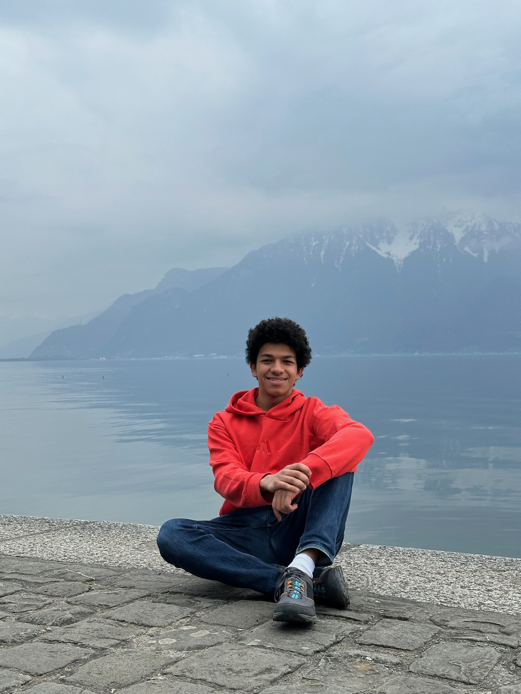

<figure class="photo float-right">
  
  <figcaption>Myself in the Swiss Alps.</figcaption>
</figure>
I am an Egyptian mathematics and physics student at Boston University.

My interests range from number theory to theoretical condensed matter physics, and gauge theory.

I am also an amateur pianist, composer, and chess player.
